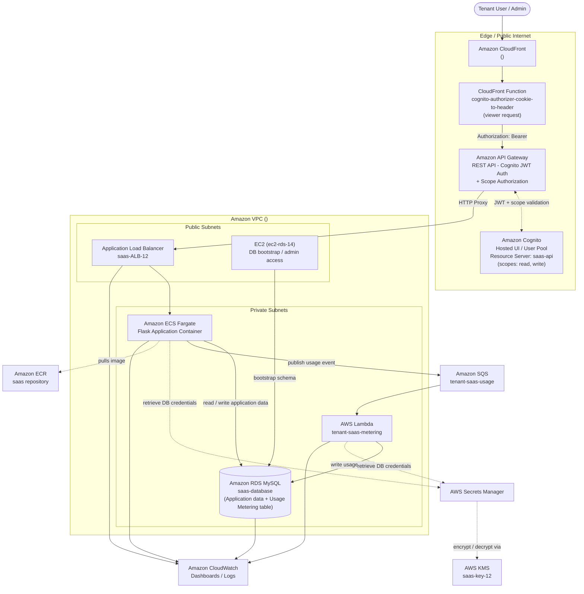

# 🏗️ Solution Architecture

## Secure Multi-Tenant SaaS Platform on AWS

---

## Document Information

| Field | Value |
|---|---|
| Document Title | Solution Architecture |
| Project Name | Secure Multi-Tenant SaaS Platform on AWS |
| Region | `<AWS_REGION>` |
| Status | Final |
| Author | Santhanakrishnan S |
| Document Date | 23 August 2026 |
| Version | 1.0 |

## Version History

| Version | Date | Author | Description |
|---|---|---|---|
| 1.0 | 23 August 2026 | Santhanakrishnan S | Initial published version, generated from AWS Configuration Document |

## Document Control

| Control Item | Detail |
|---|---|
| Source of Truth | AWS Configuration Document |
| Related Documents | 03-High-Level-Design.md, 04-Low-Level-Design.md, 05-Infrastructure-Diagram.md |

---

## Table of Contents

1. [Overview](#1-overview)
2. [Architecture Principles](#2-architecture-principles)
3. [AWS Services Used](#3-aws-services-used)
4. [Architecture Diagram](#4-architecture-diagram)
5. [Multi-Tenancy Strategy](#5-multi-tenancy-strategy)
6. [Technology Stack](#6-technology-stack)
7. [Data Flow Summary](#7-data-flow-summary)
8. [Notes and Best Practices](#8-notes-and-best-practices)
9. [Conclusion](#9-conclusion)
10. [Appendix](#10-appendix)

---

## 1. Overview

The platform is a **containerized, API-first, multi-tenant SaaS application** running entirely on managed AWS services within a single custom VPC. Public entry is through Amazon CloudFront and Amazon API Gateway; all compute and data services run in private subnets and are reached only through controlled security-group paths.

## 2. Architecture Principles

| Principle | How It Is Applied |
|---|---|
| Defense in depth | Public/private subnet separation, per-service security groups, IAM least privilege |
| Managed services first | ECS Fargate (no server management), RDS, Lambda, API Gateway, Cognito |
| Secrets never in code | AWS Secrets Manager + KMS encryption for DB credentials and app secret key |
| Loose coupling | SQS decouples the application tier from the billing/metering tier |
| Centralized identity | Amazon Cognito is the single source of truth for authentication across tenants |
| Observability by design | CloudWatch dashboards and log groups cover every tier |

## 3. AWS Services Used

| Layer | Service | Purpose |
|---|---|---|
| Networking | Amazon VPC | Isolated network with public/private subnets, IGW, NAT Gateway |
| Content Delivery | Amazon CloudFront | Global CDN / HTTPS entry point |
| Content Delivery | CloudFront Function (`cognito-authorizer-cookie-to-header`) | Viewer-request function; converts the Cognito access-token cookie into an `Authorization: Bearer` header (token forwarding only, no JWT validation) |
| API Management | Amazon API Gateway | Versioned REST API, Cognito JWT authorization + `saas-api/read` / `saas-api/write` scope enforcement |
| Load Balancing | Application Load Balancer | Routes HTTP traffic to ECS tasks |
| Compute | Amazon ECS (Fargate) | Runs the containerized Flask application |
| Compute (support) | Amazon EC2 | Used to initialize and manage the RDS database |
| Compute (async) | AWS Lambda | Processes usage/billing events from SQS |
| Data | Amazon RDS (MySQL) | Primary relational data store |
| Messaging | Amazon SQS | Decouples usage events from billing processing |
| Identity | Amazon Cognito | User authentication, JWT issuance, tenant groups, Resource Server `saas-api` with custom scopes `read`/`write` |
| Security | AWS IAM | Role-based permissions for every service |
| Security | AWS KMS | Encryption key management |
| Security | AWS Secrets Manager | Secure storage of DB credentials and app secret |
| Registry | Amazon ECR | Stores the application Docker image |
| Build Tooling | AWS CloudShell | Browser-based build/push environment |
| Monitoring | Amazon CloudWatch | Dashboards, logs, Container Insights |
| Cost Governance | AWS Budgets | Monthly budget with alert thresholds |

## 4. Architecture Diagram

> **Note:** The AWS Configuration Document implements a **single** Amazon RDS instance (`saas-database`) that serves two logical purposes: the application's own tables (read/written directly by ECS) and a `tenant_usage` table (written only by the Lambda metering function). This is shown as one RDS node above to accurately reflect what is deployed — a second, physically separate "Usage Metering RDS" instance is **not** implemented and is not claimed anywhere in this documentation set.
>
> **Note:** Amazon ECS and AWS Lambda each retrieve database credentials through **AWS Secrets Manager**, which in turn uses **AWS KMS** to encrypt/decrypt the stored secret. Neither ECS nor Lambda calls KMS directly for this credential flow — KMS is reached only indirectly, through Secrets Manager. (Separately, the `tenant-saas-task-role` IAM policy also grants ECS direct `kms:Encrypt`/`kms:Decrypt` permissions for potential application-level encryption use — see [04-Low-Level-Design.md §5.1](04-Low-Level-Design.md#51-tenant-saas-task-role-ecs-task-role) — but this is a distinct permission grant, not part of the credential-retrieval data flow shown here.)
>
> **Note:** The CloudFront Function `cognito-authorizer-cookie-to-header` runs on the **viewer request** event and performs **token forwarding only** — it converts the Cognito access-token cookie into an `Authorization: Bearer <token>` header. It does **not** validate the JWT. Signature/issuer/expiry validation and enforcement of the `saas-api/read` and `saas-api/write` authorization scopes happen downstream at the **API Gateway Cognito Authorizer** (`cognito-authorizer-06`), which checks the forwarded token against the Cognito Resource Server `saas-api`. Flask, running on ECS, remains the application/business logic layer and is not the JWT authorization boundary.

## 5. Multi-Tenancy Strategy

The platform uses a **shared application, shared database, isolated-by-identity** multi-tenancy model:

- A single ECS service and single RDS instance serve all tenants (pooled infrastructure model).
- Tenant isolation is enforced at the **identity layer** using Cognito User Groups: `TenantA_admin`, `TenantA_user`, `TenantB_admin`, `TenantB_user`.
- Every usage event captured for billing includes a `tenant_id`, allowing per-tenant usage and cost attribution downstream in RDS.
- This model favors low operating cost and simpler operations over hard infrastructure isolation, which is an appropriate trade-off for the current scale.

## 6. Technology Stack

| Layer | Technology |
|---|---|
| Application Framework | Python / Flask |
| Container Runtime | Docker (built and pushed via AWS CloudShell) |
| Database | MySQL 8.4 (Amazon RDS) |
| Async Processing | Python (AWS Lambda, `boto3`, `pymysql`) |
| Infrastructure | AWS Console-driven provisioning (VPC, ECS, IAM, etc.) |
| Authentication | OAuth 2.0 / OpenID Connect via Amazon Cognito |

## 7. Data Flow Summary

1. A tenant user authenticates via the Cognito Hosted UI and receives a JWT issued against the Cognito Resource Server `saas-api` with scopes `saas-api/read` and `saas-api/write`.
2. Requests flow: **CloudFront → CloudFront Function (cookie → `Authorization: Bearer` header) → API Gateway (Cognito JWT + scope-authorized via `cognito-authorizer-06`) → ALB → ECS (Flask app)**.
3. The Flask app reads/writes tenant and user data in RDS.
4. On billable actions, the Flask app publishes a usage event to the SQS queue.
5. The Lambda function consumes the SQS message and writes a `tenant_usage` record into RDS.
6. All components emit logs/metrics to CloudWatch for observability.

## 8. Notes and Best Practices

> **Note:** RDS, ECS, and the Lambda billing function all reside in private subnets and are unreachable directly from the internet — access is only possible through the ALB/API Gateway path or via the bastion-style EC2 instance.

- ✅ Secrets are centralized in Secrets Manager and encrypted with a customer-managed KMS key.
- ✅ IAM roles are scoped per service (`tenant-saas-task-role`, `tenant-saas-metering-role-*`, `ecsTaskExecutionRole`) rather than shared broadly.
- ⚠️ Auto Scaling is not yet configured for the ECS service — see recommendations in [07-Security-Architecture.md](07-Security-Architecture.md) and [09-Backup-and-Disaster-Recovery.md](09-Backup-and-Disaster-Recovery.md).

## 9. Conclusion

This architecture demonstrates a realistic, security-conscious SaaS pattern using fully managed AWS services, with clear separation between the public edge, application tier, and data tier, and a decoupled asynchronous billing pipeline.

## 10. Appendix

### 10.1 Placeholder Legend

| Placeholder | Represents |
|---|---|
| `<ACCOUNT_ID>` | 12-digit AWS account number |
| `<AWS_REGION>` | AWS region of deployment |
| `<VPC_ID>` | VPC identifier |
| `<CLOUDFRONT_DOMAIN>` | CloudFront distribution domain name |
| `<API_GATEWAY_URL>` | API Gateway invoke URL |
| `<COGNITO_USER_POOL_ID>` / `<COGNITO_APP_CLIENT_ID>` | Cognito identifiers |
| `<KMS_KEY_ID>` / `<KMS_KEY_ARN>` | KMS key identifiers |
| `<RDS_SECRET_NAME>` | Secrets Manager secret name |
| `<IAM_ROLE_SUFFIX>` | AWS-generated random suffix on the Lambda execution role name |
