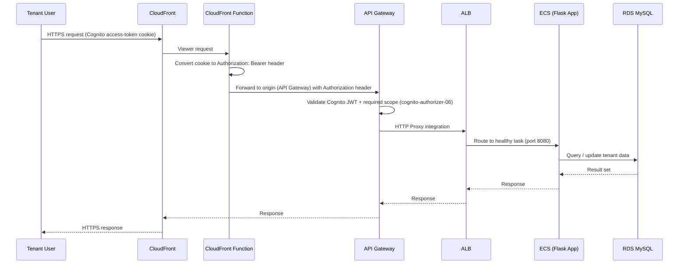
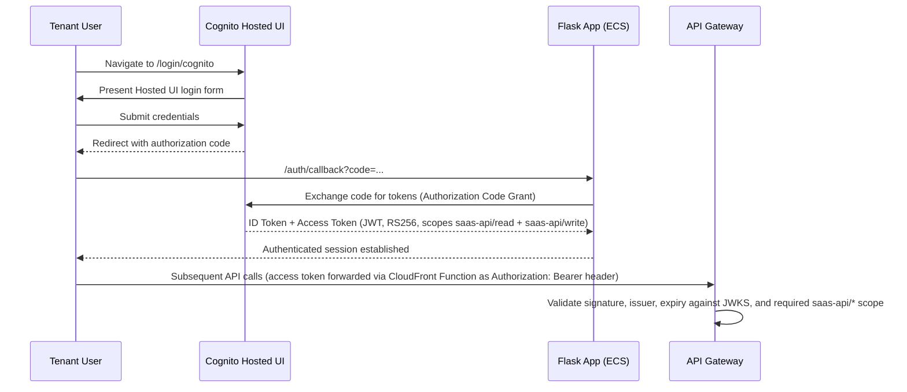
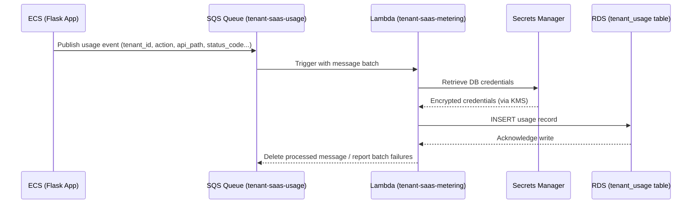

# 📐 High-Level Design (HLD)

## Secure Multi-Tenant SaaS Platform on AWS

---

## Document Information

| Field | Value |
|---|---|
| Document Title | High-Level Design |
| Project Name | Secure Multi-Tenant SaaS Platform on AWS |
| Status | Final |
| Author | Santhanakrishnan S |
| Document Date | 23 August 2026 |
| Version | 1.0 |

## Version History

| Version | Date | Author | Description |
|---|---|---|---|
| 1.0 | 23 August 2026 | Santhanakrishnan S | Initial published version, generated from AWS Configuration Document |

## Document Control

| Control Item | Detail |
|---|---|
| Related Documents | 02-Solution-Architecture.md, 04-Low-Level-Design.md |

---

## Table of Contents

1. [Purpose](#1-purpose)
2. [Component Breakdown](#2-component-breakdown)
3. [Request Flow](#3-request-flow)
4. [Authentication Flow](#4-authentication-flow)
5. [Billing / Usage-Metering Flow](#5-billing--usage-metering-flow)
6. [Component Interaction Table](#6-component-interaction-table)
7. [Notes and Best Practices](#7-notes-and-best-practices)
8. [Conclusion](#8-conclusion)
9. [Appendix](#9-appendix)

---

## 1. Purpose

This document decomposes the platform into its major functional components and describes how they interact, without going into resource-level configuration (covered in the Low-Level Design).

## 2. Component Breakdown

| Component | Responsibility |
|---|---|
| **Network Layer** | VPC, public/private subnets, IGW, NAT Gateway, route tables, security groups |
| **Edge Layer** | CloudFront (CDN/HTTPS) + CloudFront Function (`cognito-authorizer-cookie-to-header`, token forwarding), API Gateway (REST API + Cognito JWT authorization and scope enforcement) |
| **Compute Layer** | ECS Fargate (application), EC2 (DB bootstrap), Lambda (billing) |
| **Data Layer** | RDS MySQL |
| **Identity Layer** | Amazon Cognito (User Pool, Hosted UI, User Groups, Resource Server `saas-api` with custom scopes `read`/`write`) |
| **Messaging Layer** | Amazon SQS |
| **Security Layer** | IAM, KMS, Secrets Manager |
| **Delivery Layer** | Amazon ECR, AWS CloudShell |
| **Observability Layer** | Amazon CloudWatch |
| **Cost Layer** | AWS Budgets |

## 3. Request Flow



## 4. Authentication Flow



The access token is scoped against the Cognito **Resource Server** `saas-api`, which defines two custom scopes — `read` and `write` — issued to the token as `saas-api/read` and `saas-api/write`. The authorization concept is:

```
Cognito Resource Server (saas-api)
        ↓
Custom Scopes (read, write)
        ↓
Access Token (saas-api/read, saas-api/write)
        ↓
API Gateway Cognito Authorizer (cognito-authorizer-06)
        ↓
Protected API resources
```

## 5. Billing / Usage-Metering Flow



## 6. Component Interaction Table

| From | To | Protocol / Mechanism | Purpose |
|---|---|---|---|
| CloudFront | CloudFront Function | Viewer request event | Convert Cognito access-token cookie to `Authorization: Bearer` header (token forwarding only) |
| CloudFront Function | API Gateway | HTTPS (origin) | Deliver app to end users with forwarded Authorization header |
| API Gateway | Cognito | JWT / JWKS validation + `saas-api/read`, `saas-api/write` scope check | Authorize API requests (`cognito-authorizer-06`) |
| API Gateway | ALB | HTTP Proxy Integration | Forward to application |
| ALB | ECS | HTTP (port 8080) | Route to container task |
| ECS | RDS | MySQL (port 3306) | Application data access |
| ECS | Secrets Manager | AWS SDK (`GetSecretValue`) | Retrieve DB credentials |
| ECS | SQS | AWS SDK (`SendMessage`) | Publish usage events |
| SQS | Lambda | Event source mapping | Trigger billing processing |
| Lambda | RDS | MySQL (`pymysql`) | Persist usage records |
| Lambda | Secrets Manager | AWS SDK | Retrieve DB credentials |
| EC2 | RDS | MySQL (port 3306) | Schema bootstrap / admin queries |
| ECS / Lambda / ALB / RDS | CloudWatch | Logs & Metrics API | Observability |

## 7. Notes and Best Practices

> **Best Practice:** Keeping JWT validation at the API Gateway layer (rather than inside the Flask app) centralizes authorization and reduces the attack surface reaching the application tier.

- The billing pipeline is intentionally **asynchronous** (SQS + Lambda) so that usage-tracking never blocks or slows the user-facing request path.
- The EC2 instance is used purely as an administrative bootstrap host for the database and is not part of the live request path.

## 8. Conclusion

The high-level design confirms a clean separation between the synchronous user-facing request path and the asynchronous billing path, with identity validation enforced at the edge before traffic reaches internal compute.

## 9. Appendix

See [04-Low-Level-Design.md](04-Low-Level-Design.md) for exact resource configuration values referenced by each component above.
