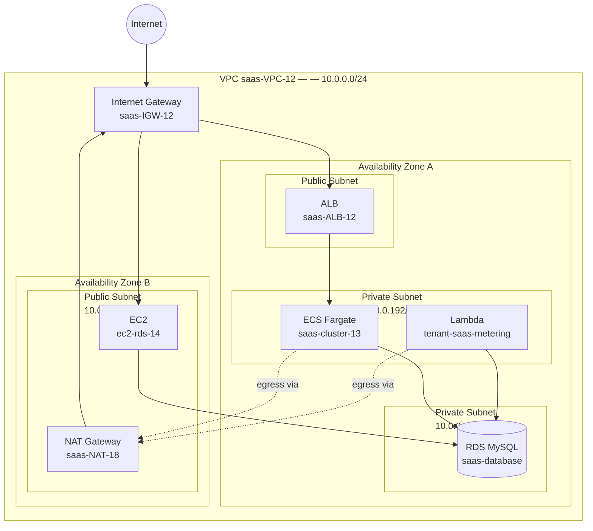
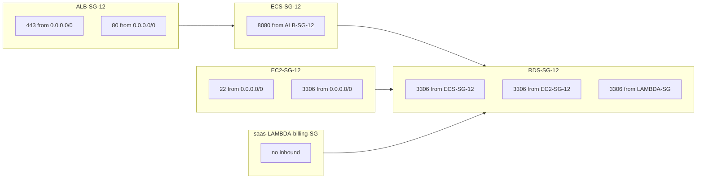
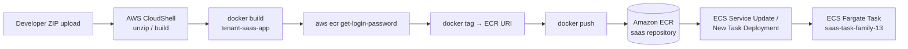
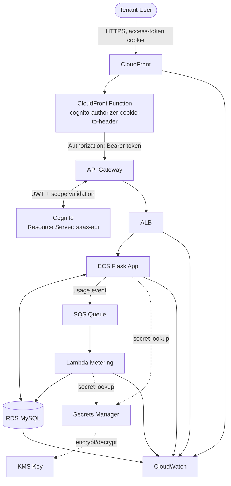

# 🗺️ Infrastructure Diagram

## Secure Multi-Tenant SaaS Platform on AWS

---

## Document Information

| Field | Value |
|---|---|
| Document Title | Infrastructure Diagram |
| Project Name | Secure Multi-Tenant SaaS Platform on AWS |
| Status | Final |
| Author | Santhanakrishnan S |
| Document Date | 23 August 2026 |
| Version | 1.0 |

## Version History

| Version | Date | Author | Description |
|---|---|---|---|
| 1.0 | 23 August 2026 | Santhanakrishnan S | Initial published version, generated from AWS Configuration Document |

---

## Table of Contents

1. [Network Topology Diagram](#1-network-topology-diagram)
2. [Subnet & Security Group Map](#2-subnet--security-group-map)
3. [CI/CD Build & Deploy Pipeline](#3-cicd-build--deploy-pipeline)
4. [Data Flow Diagram](#4-data-flow-diagram)
5. [Notes](#5-notes)
6. [Conclusion](#6-conclusion)
7. [Appendix](#7-appendix)

---

## 1. Network Topology Diagram

## 2. Subnet & Security Group Map

## 3. CI/CD Build & Deploy Pipeline

*Note: this reflects a manual CloudShell-driven build/push process; no automated CI/CD pipeline (e.g. CodePipeline) is currently configured — see recommendation in [06-Deployment-Guide-SOP.md](06-Deployment-Guide-SOP.md).*

## 4. Data Flow Diagram

## 5. Notes

- All diagrams reflect the **implemented** state of the AWS Configuration Document, not an idealized target architecture.
- Dashed arrows represent control-plane / credential-retrieval interactions; solid arrows represent primary data-plane traffic.
- The single `RDS MySQL` node shown throughout represents one physical Amazon RDS instance (`saas-database`) that hosts both the application's own tables (accessed directly by ECS) and the `tenant_usage` table (written only by Lambda). This documentation set does not claim a second, separate "Usage Metering" RDS instance — see [02-Solution-Architecture.md §4](02-Solution-Architecture.md#4-architecture-diagram) for the same clarification.
- Amazon KMS is reached only through AWS Secrets Manager in the credential-retrieval flow shown in Section 4 — ECS and Lambda do not call KMS directly for secret decryption in these diagrams.
- The CloudFront Function `cognito-authorizer-cookie-to-header` shown in Section 4 performs **token forwarding only** (cookie → `Authorization: Bearer` header). JWT validation and `saas-api/read` / `saas-api/write` scope enforcement occur at the API Gateway Cognito Authorizer, not at the CloudFront Function — see [07-Security-Architecture.md §5](07-Security-Architecture.md#5-application-layer-authentication) for the full authorization boundary discussion.

## 6. Conclusion

These diagrams provide a visual reference that should be read alongside the Low-Level Design for exact configuration values.

## 7. Appendix

Diagrams are authored in [Mermaid](https://mermaid.js.org/) syntax and render natively in GitHub Markdown previews.
