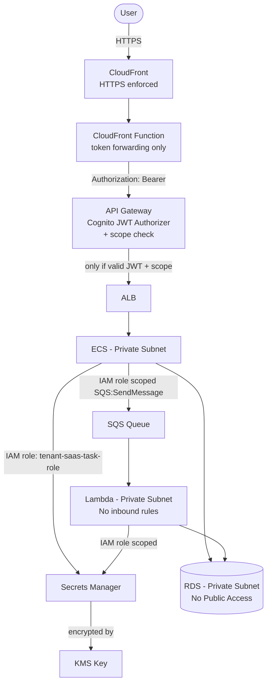

# 🔐 Security Architecture

## Secure Multi-Tenant SaaS Platform on AWS

---

## Document Information

| Field | Value |
|---|---|
| Document Title | Security Architecture |
| Project Name | Secure Multi-Tenant SaaS Platform on AWS |
| Status | Final |
| Author | Santhanakrishnan S |
| Document Date | 23 August 2026 |
| Version | 1.0 |

## Version History

| Version | Date | Author | Description |
|---|---|---|---|
| 1.0 | 23 August 2026 | Santhanakrishnan S | Initial published version, generated from AWS Configuration Document |

---

## Table of Contents

1. [Security Objectives](#1-security-objectives)
2. [Identity and Access Management](#2-identity-and-access-management)
3. [Network Security](#3-network-security)
4. [Data Protection](#4-data-protection)
5. [Application-Layer Authentication](#5-application-layer-authentication)
6. [Edge Security](#6-edge-security)
7. [Security Findings and Recommendations](#7-security-findings-and-recommendations)
8. [Security Diagram](#8-security-diagram)
9. [Best Practices Applied](#9-best-practices-applied)
10. [Conclusion](#10-conclusion)
11. [Appendix](#11-appendix)

---

## 1. Security Objectives

| Objective | Description |
|---|---|
| Least privilege | Each service operates under its own IAM role scoped to its actual needs |
| Defense in depth | Multiple independent layers (network, identity, encryption) must each fail for a breach to succeed |
| No plaintext secrets | Credentials are centralized in Secrets Manager, encrypted with KMS |
| Strong authentication | All user access is brokered through Amazon Cognito using JWT/OAuth2 |
| Network isolation | Data and compute tiers run in private subnets, unreachable directly from the internet |

## 2. Identity and Access Management

| Role | Trusted Entity | Key Permissions |
|---|---|---|
| `tenant-saas-task-role` | ECS Tasks | Cognito, KMS, CloudWatch Logs, Secrets Manager, SQS `SendMessage` |
| `tenant-saas-metering-role-*` | Lambda | Secrets Manager (scoped to one secret), KMS `Decrypt` (scoped to one key), SQS consume actions, VPC networking |
| `ecsTaskExecutionRole` | ECS Tasks | `AmazonECSTaskExecutionRolePolicy` (image pull, log write) |

Each role's trust policy restricts `sts:AssumeRole` to a single AWS service principal, preventing cross-service role assumption.

## 3. Network Security

- The VPC (`<VPC_ID>`) separates resources into public subnets (ALB, EC2 bootstrap host) and private subnets (ECS, RDS, Lambda).
- Security groups form a chained trust model: `ALB-SG-12 → ECS-SG-12 → RDS-SG-12`, with each group only accepting traffic from the specific security group in front of it, not from arbitrary CIDR ranges.
- RDS has **no public access** and sits entirely in private subnets.
- The Lambda billing function has **no inbound rules at all** — it only initiates outbound connections.

## 4. Data Protection

| Data | Protection Mechanism |
|---|---|
| Database credentials | Stored in AWS Secrets Manager, encrypted with customer-managed KMS key `saas-key-12` |
| RDS storage | Encryption at rest enabled |
| Data in transit (public) | CloudFront enforces HTTPS via "Redirect HTTP to HTTPS" |
| Application secret key (`FLASK_SECRET_KEY`) | Stored in Secrets Manager alongside DB credentials |

## 5. Application-Layer Authentication

- Amazon Cognito issues **ID and Access Tokens** as signed JWTs (`RS256`) via the Authorization Code Grant flow, scoped against the Cognito **Resource Server** `saas-api` (custom scopes `saas-api/read`, `saas-api/write`).
- A **CloudFront Function** (`cognito-authorizer-cookie-to-header`, viewer-request event) converts the Cognito access-token cookie into an `Authorization: Bearer <token>` header before the request reaches API Gateway. This function performs **token forwarding only** — it does not validate the JWT.
- The **API Gateway Cognito Authorizer** (`cognito-authorizer-06`) is the actual JWT authorization boundary: it validates the token against Cognito's published JWKS endpoint (signature, issuer, expiry) and enforces the required `saas-api/read` or `saas-api/write` authorization scope per method, before any request reaches the ALB/ECS tier — unauthenticated, tampered, or under-scoped requests never reach application code.
- **Primary JWT authentication and API-scope authorization** is performed by the Amazon API Gateway Cognito User Pool Authorizer — Flask, running on ECS, is **not** independently validating the Cognito JWT as the primary authentication mechanism.
- **Application-level authorization** is performed by the Flask application itself: after a request passes the API Gateway authorizer, Flask performs tenant isolation, role checks (via Cognito User Groups), business rules, and other resource-level/application-level validation. Flask is the application/business-logic layer, not the JWT authentication or API-scope authorization boundary — but it does perform its own authorization at the application level.
- Tenant-level authorization is modeled through Cognito User Groups (`TenantA_admin`, `TenantA_user`, `TenantB_admin`, `TenantB_user`), which the application uses to enforce role-based access control.

The authorization boundary, end to end:

```
Cognito
  → JWT Access Token (saas-api/read, saas-api/write)
  → CloudFront Function (token forwarding: cookie → Authorization header)
  → API Gateway Cognito Authorizer (cognito-authorizer-06)
  → Scope Authorization (saas-api/read, saas-api/write)
  → ALB
  → ECS Flask App (business logic only)
```

## 6. Edge Security

| Control | Status |
|---|---|
| HTTPS enforcement | ✅ Enabled (Redirect HTTP → HTTPS) |
| Compression | ✅ Enabled |
| CloudFront Function token forwarding (`cognito-authorizer-cookie-to-header`) | ✅ Enabled — forwards token only, performs no JWT validation |
| AWS WAF | ❌ Disabled |
| CloudFront access logging | ❌ Disabled |
| Custom domain + dedicated TLS certificate | ❌ Not configured (default CloudFront domain in use) |

## 7. Security Findings and Recommendations

| # | Finding | Risk | Recommendation |
|---|---|---|---|
| 1 | `EC2-SG-12` allows SSH (22) and MySQL (3306) from `0.0.0.0/0` | High | Restrict to a specific administrator CIDR or use AWS Systems Manager Session Manager instead of SSH |
| 2 | `tenant-saas-task-role` attaches broad AWS-managed policies (`SecretsManagerReadWrite`, `AWSKeyManagementServicePowerUser`) | Medium | Replace with narrowly scoped custom policies limited to the specific secret and key ARNs |
| 3 | KMS key rotation disabled | Medium | Enable automatic annual rotation |
| 4 | Secrets Manager rotation disabled | Medium | Enable automated rotation for database credentials |
| 5 | `DB_PASSWORD` and `FLASK_SECRET_KEY` present as plaintext ECS environment variables (in addition to Secrets Manager) | Medium | Use ECS native `secrets` injection referencing the Secrets Manager ARN instead of plaintext values in the task definition |
| 6 | AWS WAF not attached to CloudFront | Medium | Attach a WAF Web ACL with managed rule groups (e.g. common attack protection, rate limiting) |
| 7 | CloudFront access logging disabled | Low | Enable logging to an S3 bucket for audit/forensics |
| 8 | Cognito MFA not enabled | Medium | Require MFA at minimum for `*_admin` groups |
| 9 | SQS has no Dead Letter Queue | Low | Add a DLQ with a redrive policy to avoid silently losing failed billing events |
| 10 | ECR scan-on-push disabled | Low | Enable image scanning to catch vulnerable base images/dependencies |

## 8. Security Diagram



## 9. Best Practices Applied

- ✅ Private-subnet isolation for all data and core compute
- ✅ Security-group-to-security-group referencing instead of broad CIDR rules for internal traffic
- ✅ Centralized secret storage with KMS encryption
- ✅ API Gateway-level JWT validation and authorization-scope enforcement (API Gateway Cognito Authorizer) before requests reach internal services, with a clear separation between token forwarding (CloudFront Function) and token validation (API Gateway)
- ✅ Per-service IAM roles rather than one shared role

## 10. Conclusion

The platform implements solid foundational security controls — network segmentation, centralized secrets, and API Gateway-level JWT authentication and scope authorization — while leaving room for hardening in access-scope tightening, key/secret rotation, MFA, and edge protection (WAF/logging), all captured in Section 7 as concrete, actionable recommendations.

## 11. Appendix

### 11.1 Related Documents

- 04-Low-Level-Design.md (source configuration for every finding above)
- 08-Monitoring-and-Logging.md
