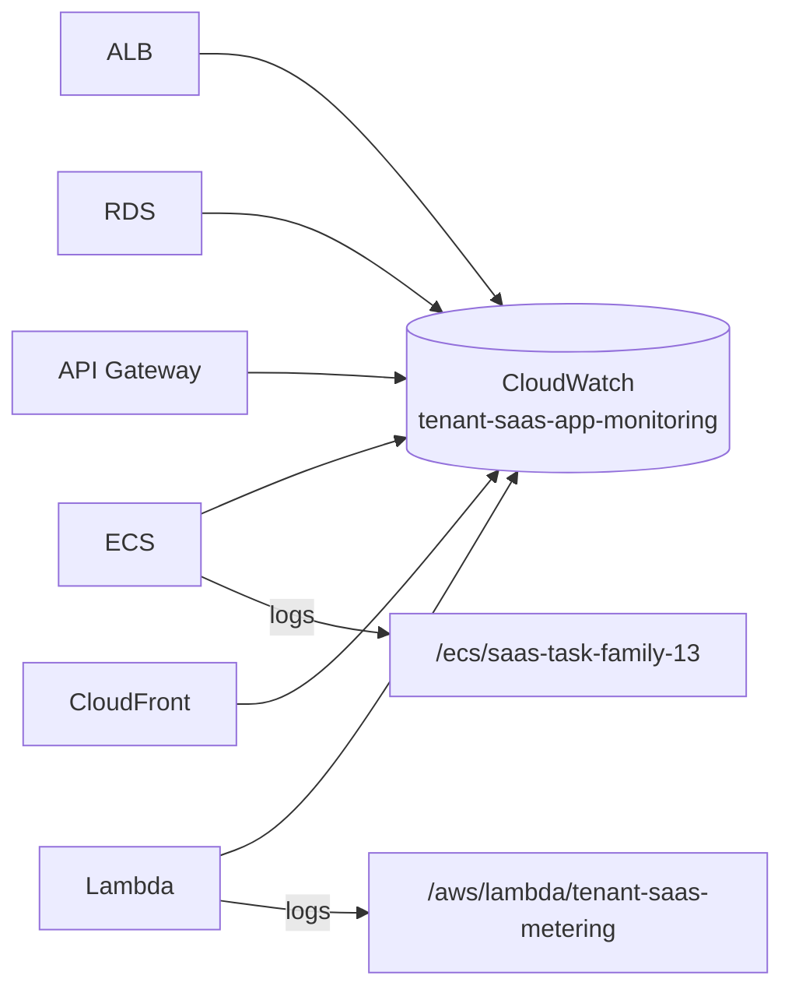

# 📊 Monitoring and Logging

## Secure Multi-Tenant SaaS Platform on AWS

---

## Document Information

| Field | Value |
|---|---|
| Document Title | Monitoring and Logging |
| Project Name | Secure Multi-Tenant SaaS Platform on AWS |
| Status | Final |
| Author | Santhanakrishnan S |
| Document Date | 23 August 2026 |
| Version | 1.0 |

## Version History

| Version | Date | Author | Description |
|---|---|---|---|
| 1.0 | 23 August 2026 | Santhanakrishnan S | Initial published version, generated from AWS Configuration Document |

---

## Table of Contents

1. [Purpose](#1-purpose)
2. [CloudWatch Dashboard](#2-cloudwatch-dashboard)
3. [Metrics by Service](#3-metrics-by-service)
4. [Log Groups](#4-log-groups)
5. [Container Insights](#5-container-insights)
6. [Monitoring Coverage Diagram](#6-monitoring-coverage-diagram)
7. [Gaps and Recommendations](#7-gaps-and-recommendations)
8. [Best Practices](#8-best-practices)
9. [Conclusion](#9-conclusion)
10. [Appendix](#10-appendix)

---

## 1. Purpose

Monitor, collect, and analyze the performance, availability, and health of the SaaS platform's AWS resources through a single centralized dashboard and a consistent logging strategy.

## 2. CloudWatch Dashboard

| Attribute | Value |
|---|---|
| Dashboard Name | `tenant-saas-app-monitoring` |
| Purpose | Centralized view of ECS, Lambda, RDS, ALB, API Gateway, and CloudFront performance metrics for monitoring and troubleshooting |
| Status | Active |

## 3. Metrics by Service

| Service | Metrics Tracked |
|---|---|
| Application Load Balancer | `RequestCount`, `TargetResponseTime`, `ActiveConnectionCount` |
| Amazon RDS | `FreeStorageSpace`, `CPUUtilization`, `DatabaseConnections` |
| Amazon API Gateway | `Count`, `Latency`, `4XXError`, `5XXError` (`4XXError` covers both Cognito Authorizer `401` authentication failures and `403` scope-authorization failures for `saas-api/read` / `saas-api/write`) |
| Amazon ECS (Fargate) | `CPUUtilization`, `MemoryUtilization` |
| AWS Lambda | `Duration`, `Invocations`, `Errors` |
| Amazon CloudFront | `Requests`, `4XXErrorRate`, `5XXErrorRate`, `BytesDownloaded` |

## 4. Log Groups

| Log Group | Source | Retention | Purpose |
|---|---|---|---|
| `/ecs/saas-task-family-13` | ECS Flask application | 30 days | Troubleshoot application errors, track activity |
| `/aws/lambda/tenant-saas-metering` | Billing Lambda | 30 days (dashboard config notes "never expire" for log metrics view — see note below) | Track usage-event processing, verify billing pipeline health |

> **Note:** The source configuration lists log retention as both "30 days" (Container Insights/Log Retention field) and "never expire" (Log metrics field) in different places. This document reports both as recorded; treat "30 days" as the operative CloudWatch Logs retention setting and confirm the discrepancy in the console before relying on long-term log availability.

## 5. Container Insights

Container Insights is **enabled** for the ECS Fargate cluster `saas-cluster-13` (task family `saas-task-family-13`), providing task/container-level CPU, memory, network, and storage metrics beyond the standard ECS service metrics.

## 6. Monitoring Coverage Diagram

## 6.1 Verifying Cognito / API Gateway Authorization Behavior

To confirm the CloudFront Function → API Gateway Cognito Authorizer → ALB → ECS chain is functioning correctly, review the following in the API Gateway `4XXError` metric and `/ecs/saas-task-family-13` logs:

| Scenario | Where to Observe | Expected Signal |
|---|---|---|
| Missing/invalid/expired JWT | API Gateway `4XXError` (`401`) | Request rejected before reaching the ALB; no corresponding ECS log entry |
| Valid JWT but missing required `saas-api/read` or `saas-api/write` scope | API Gateway `4XXError` (`403`) | Request rejected at the authorizer; no corresponding ECS log entry |
| Valid JWT with correct scope | API Gateway `Count` (2XX/passthrough) + ECS logs | Request reaches Flask on ECS; evidence in `/ecs/saas-task-family-13` |

## 7. Gaps and Recommendations

| Gap | Impact | Recommendation |
|---|---|---|
| No CloudWatch Alarms configured | Issues are only visible when someone views the dashboard | Add alarms on error rates (API 5XX, Lambda Errors), RDS `FreeStorageSpace`, and ECS CPU/Memory |
| No SNS notification topic | No proactive alerting | Create an SNS topic and subscribe email/Slack/chat integration for alarm notifications |
| No metric filters on log groups | Cannot alert on specific log patterns (e.g. exception traces) | Add metric filters for error keywords in both log groups |
| Log retention discrepancy | Risk of losing logs earlier than expected, or storing longer than needed | Standardize and confirm retention setting per log group |

## 8. Best Practices

- Centralizing all service metrics onto a single dashboard significantly shortens troubleshooting time during an incident.
- Container Insights being enabled from the start avoids having to backfill task-level visibility later.
- Pairing every asynchronous component (Lambda) with its own dedicated log group keeps billing-pipeline issues easy to isolate from application-tier issues.

## 9. Conclusion

The platform has broad metric and log coverage across every tier, but currently operates in a "dashboard-only" observability mode. Adding alarms and notifications (Section 7) would convert this into a proactive monitoring posture.

## 10. Appendix

### 10.1 Related Documents

- 04-Low-Level-Design.md
- 07-Security-Architecture.md
