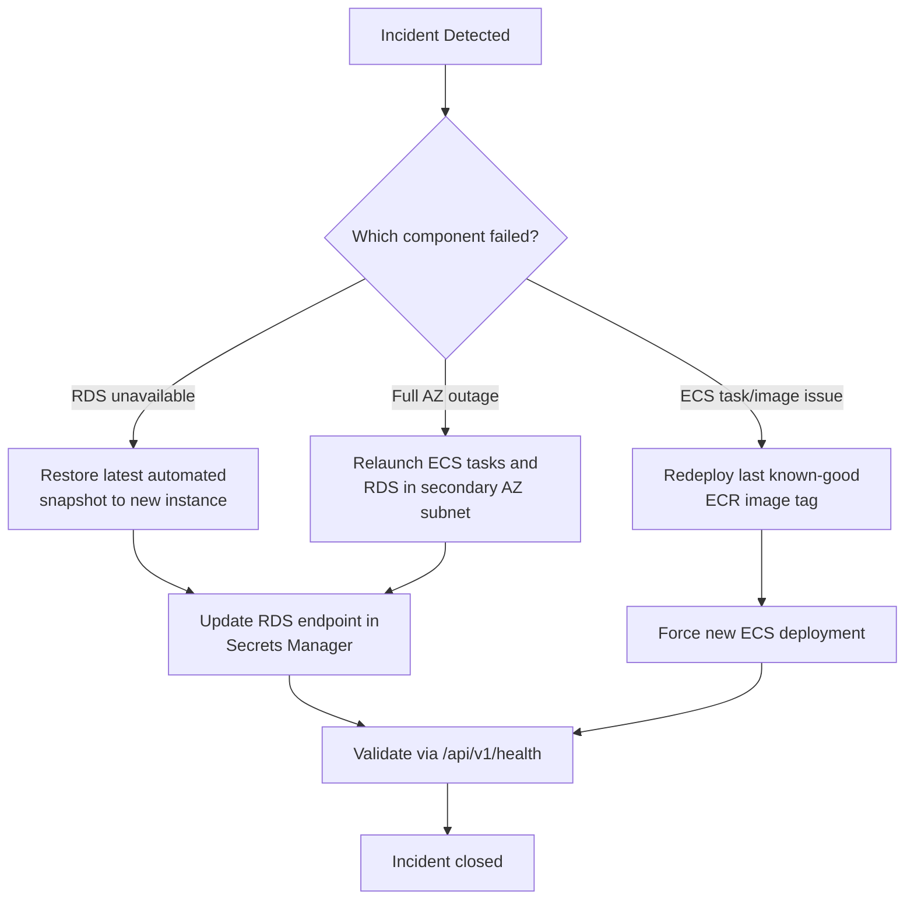

# 🛡️ Backup and Disaster Recovery

## Secure Multi-Tenant SaaS Platform on AWS

---

## Document Information

| Field | Value |
|---|---|
| Document Title | Backup and Disaster Recovery |
| Project Name | Secure Multi-Tenant SaaS Platform on AWS |
| Status | Final |
| Author | Santhanakrishnan S |
| Document Date | 23 August 2026 |
| Version | 1.0 |

## Version History

| Version | Date | Author | Description |
|---|---|---|---|
| 1.0 | 23 August 2026 | Santhanakrishnan S | Initial published version, generated from AWS Configuration Document |

---

## Table of Contents

1. [Purpose](#1-purpose)
2. [Current State by Component](#2-current-state-by-component)
3. [Recovery Objectives](#3-recovery-objectives)
4. [Missing Information](#4-missing-information)
5. [Recommended Backup Strategy](#5-recommended-backup-strategy)
6. [Recommended Disaster Recovery Strategy](#6-recommended-disaster-recovery-strategy)
7. [Best Practices](#7-best-practices)
8. [Conclusion](#8-conclusion)
9. [Appendix](#9-appendix)

---

## 1. Purpose

Document the platform's current resilience posture and define a target backup and disaster-recovery (BCDR) strategy appropriate to its scale.

## 2. Current State by Component

| Component | Redundancy Today | Notes |
|---|---|---|
| RDS (`saas-database`) | Single-AZ, `db.t4g.micro` | No Multi-AZ standby configured |
| ECS Service | `desired count: 1` in one private subnet (single AZ) | No cross-AZ task spread; no Auto Scaling |
| ECR image | Single tag (`latest`) | No image version history/lifecycle policy |
| Lambda | Regional, VPC-attached | Inherently resilient to AZ failure within Lambda's managed infrastructure |
| VPC | Spans 2 AZs (subnets exist in both), but the *application stack itself* is concentrated in AZ-a | See [04-Low-Level-Design.md](04-Low-Level-Design.md) subnet table |
| CloudFront | Global edge network by default | Not a single point of failure |

## 3. Recovery Objectives

The AWS Configuration Document does not define explicit RTO/RPO targets. As a portfolio/internship-scale project, the following are proposed as reasonable defaults rather than committed SLAs:

| Metric | Proposed Target |
|---|---|
| Recovery Point Objective (RPO) | ≤ 24 hours (daily automated RDS snapshot) |
| Recovery Time Objective (RTO) | ≤ 4 hours (manual redeploy from ECR + snapshot restore) |

## 4. Missing Information

The following could not be determined from the AWS Configuration Document and should be confirmed directly in the AWS Console before relying on this document for real recovery planning:

- RDS automated backup retention window (days) and backup window schedule
- Whether RDS automated backups are enabled at all
- Whether any manual RDS snapshots currently exist
- ECR lifecycle/retention policy (none was recorded — likely not configured)
- Any existing runbook or tested recovery procedure

## 5. Recommended Backup Strategy

| Resource | Recommendation |
|---|---|
| RDS | Enable automated backups with at least a 7-day retention window; take a manual snapshot before any risky change (e.g. engine version upgrade) |
| ECR | Retain the last N tagged image versions via a lifecycle policy so a previous known-good image can always be redeployed |
| Secrets Manager | Secrets are durable by design; ensure the KMS key protecting them is never scheduled for deletion without a documented replacement plan |
| Infrastructure definitions | Consider capturing the manually-created resources in this document (or as Infrastructure-as-Code) so the environment can be rebuilt without relying on console memory |

## 6. Recommended Disaster Recovery Strategy

- **Data tier failure:** Restore from the most recent RDS automated backup or manual snapshot into a new instance in the existing private subnets; update the `host` field in Secrets Manager and restart the ECS service to pick up the change.
- **Compute tier failure:** Because the application is fully containerized in ECR, recovery is a matter of forcing a new ECS deployment (or standing up the cluster/service fresh from this documentation) rather than reinstalling a server.
- **Full single-AZ outage:** Since the VPC already has subnets in a second AZ, recovery would involve relaunching the ECS service and (if needed) an RDS instance in the second AZ's private subnet — this is currently a manual process, not an automatic failover.

## 7. Best Practices

- Treat RDS snapshots as the primary recovery mechanism for data loss scenarios; treat ECR image tags as the primary recovery mechanism for application-level regressions.
- Periodically test a restore (not just take backups) to validate that the RPO/RTO targets are actually achievable.
- Document any manual console changes immediately in this document so DR runbooks stay accurate.

## 8. Conclusion

The platform currently has no confirmed automated backup or Multi-AZ failover in place. For a portfolio-scale project this is an acceptable and explainable trade-off, but it should be explicitly called out — as this document does — rather than assumed, and the recommendations above provide a clear, low-cost path to improving resilience.

## 9. Appendix

### 9.1 Related Documents

- 04-Low-Level-Design.md
- 10-Cost-Estimation.md (cost impact of enabling Multi-AZ / backups)
