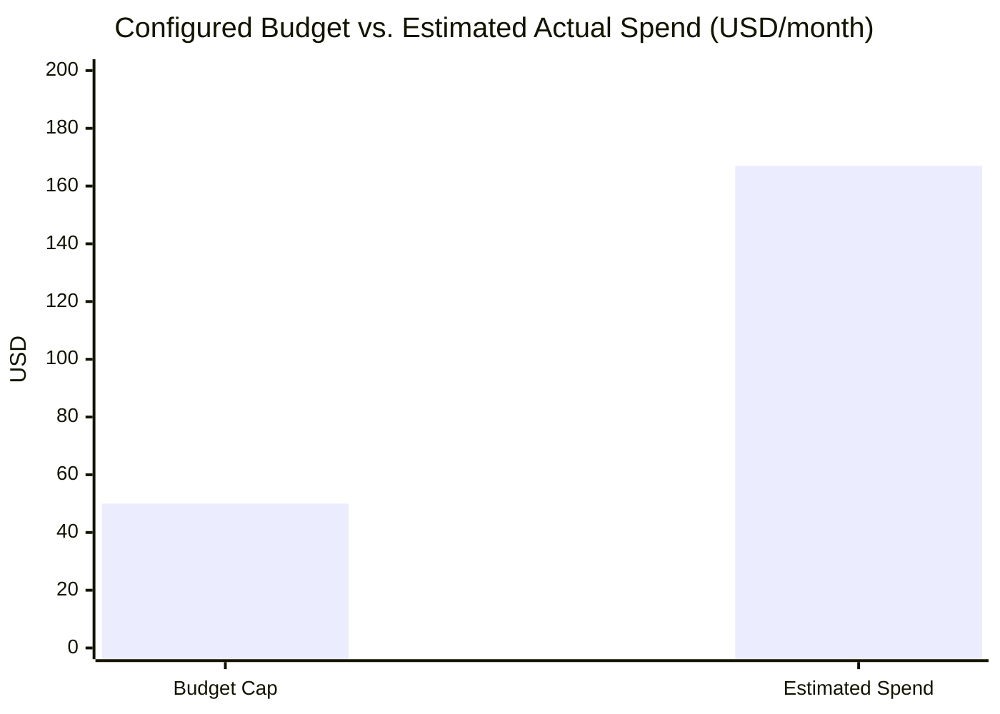

# 💰 Cost Estimation

## Secure Multi-Tenant SaaS Platform on AWS

---

## Document Information

| Field | Value |
|---|---|
| Document Title | Cost Estimation |
| Project Name | Secure Multi-Tenant SaaS Platform on AWS |
| Status | Final |
| Author | Santhanakrishnan S |
| Document Date | 23 August 2026 |
| Version | 1.0 |
| Pricing Reference | Public AWS on-demand pricing, US East (N. Virginia), as of 2026 |

## Version History

| Version | Date | Author | Description |
|---|---|---|---|
| 1.0 | 23 August 2026 | Santhanakrishnan S | Initial published version, generated from AWS Configuration Document |

## Document Control

> ⚠️ Figures below are **estimates** derived from published AWS on-demand rates applied to the exact instance sizes and resource quantities recorded in the AWS Configuration Document. They are **not** pulled from AWS Cost Explorer / actual billing data, which was not provided as a source. Always verify against the AWS Pricing Calculator and Cost Explorer before relying on these numbers financially.

---

## Table of Contents

1. [Configured Budget](#1-configured-budget)
2. [Estimated Monthly Cost by Service](#2-estimated-monthly-cost-by-service)
3. [Budget vs. Estimated Spend](#3-budget-vs-estimated-spend)
4. [Primary Cost Drivers](#4-primary-cost-drivers)
5. [Cost Optimization Recommendations](#5-cost-optimization-recommendations)
6. [Forecasting](#6-forecasting)
7. [Best Practices](#7-best-practices)
8. [Conclusion](#8-conclusion)
9. [Appendix](#9-appendix)

---

## 1. Configured Budget

| Attribute | Value |
|---|---|
| Budget Name | `tenant-saas-monthly-budget` |
| Budget Type | Cost budget |
| Budget Amount | $50.00 / month |
| Alert Thresholds | Actual > 50% ($25); Forecasted > 80% ($40); Actual > 80% ($40); Actual > 100% ($50) |
| Notification | Email, enabled |
| Currency | USD |
| Status | Active |

## 2. Estimated Monthly Cost by Service

| Service | Configuration | Estimated Monthly Cost (USD) | Basis |
|---|---|---|---|
| Amazon ECS (Fargate) | 1 vCPU / 3 GB, 1 task, 24/7 | ~$39 | `$0.04048`/vCPU-hr + `$0.004445`/GB-hr × 730 hrs |
| Amazon RDS (instance) | `db.t4g.micro`, 24/7 | ~$12 | `$0.016`/hr × 730 hrs |
| Amazon RDS (storage) | 400 GiB gp2 | ~$40–46 | ~`$0.10–0.115`/GB-month |
| NAT Gateway | 1 gateway, 24/7 + processing | ~$33+ | `$0.045`/hr × 730 hrs, plus `$0.045`/GB processed |
| Application Load Balancer | 1 ALB, low traffic | ~$17–25 | Base hourly rate + LCU-hours |
| Amazon EC2 | `t3.micro`, 24/7 | ~$8 | On-demand Linux hourly rate |
| Amazon API Gateway | REST API, low volume | ~$1–3 | Per-million-request pricing at small scale |
| Amazon CloudFront | Low request/data volume | ~$1–5 | Pay-per-request/data-transfer |
| AWS Lambda | Low invocation volume | ~$0 | Well within Lambda's monthly free tier |
| Amazon SQS | Low message volume | ~$0 | Well within SQS's monthly free tier |
| AWS Secrets Manager | 1 secret | ~$0.40–1 | `$0.40`/secret/month + API call charges |
| AWS KMS | 1 customer-managed key | ~$1 | `$1`/key/month + request charges |
| Amazon ECR | ~144 MB image | <$0.10 | Per-GB-month storage |
| Amazon CloudWatch | Dashboard + logs + Container Insights | ~$3–8 | Dashboard fee + log ingestion/storage + enhanced metrics |
| Amazon Cognito | Low MAU count | ~$0 | Within Cognito's free monthly active user tier |
| **Estimated Total** | | **~$155–180 / month** | Sum of above |

## 3. Budget vs. Estimated Spend

> ⚠️ **Key Finding:** At the resource sizes actually configured, estimated spend (~$155–180/month) is roughly **3–4× the configured $50 monthly budget**. The budget's alert thresholds (50/80/100%) will almost certainly all fire in the first billing cycle unless resource sizing is reduced. This is the single most important finding in this document and should be resolved before this deployment is treated as "within budget."

## 4. Primary Cost Drivers

Ranked by estimated monthly impact:

1. **RDS storage (400 GiB allocated)** — by far the largest single line item (~$40–46/month) for a database that, per the configuration document, currently holds one small application schema. This allocation appears significantly oversized for the workload.
2. **Amazon ECS Fargate (1 vCPU / 3 GB, always-on)** — the second-largest driver (~$39/month); Fargate bills for *provisioned* resources regardless of actual utilization.
3. **NAT Gateway (always-on, hourly + data processing)** — a fixed cost (~$33+/month) that exists purely to give private-subnet resources (ECS, Lambda) outbound internet/API access.
4. **Application Load Balancer** — fixed hourly charge plus LCU-hours (~$17–25/month), largely unavoidable for the current architecture.

Together these four items account for the large majority of estimated spend; every other service is a comparatively minor contributor.

## 5. Cost Optimization Recommendations

| # | Recommendation | Estimated Monthly Savings |
|---|---|---|
| 1 | Reduce RDS allocated storage from 400 GiB to a size matching actual data volume (e.g. 20–50 GiB, with storage autoscaling enabled) | ~$30–40 |
| 2 | Right-size the ECS Fargate task (test whether 0.5 vCPU / 1–2 GB is sufficient) | ~$15–20 |
| 3 | Replace the NAT Gateway with **VPC Gateway/Interface Endpoints** for AWS service traffic (S3, Secrets Manager, ECR, CloudWatch, SQS) where possible, reducing NAT data-processing charges | Variable, potentially significant |
| 4 | Consider a 1-year Compute Savings Plan for Fargate once usage is stable | Up to ~20% of Fargate cost |
| 5 | Consider RDS Reserved Instance pricing once the instance size is finalized | Up to ~28% of RDS compute cost |
| 6 | Revisit whether the EC2 bootstrap instance needs to remain running continuously, or can be stopped when not actively administering the database | ~$8 if stopped most of the time |

## 6. Forecasting

AWS Cost Explorer's forecasting feature (enabled by default under this account's Billing setup) predicts future spend based on current usage and historical billing trends. Given the gap identified in Section 3, the forecast should be reviewed immediately after the first few days of usage to confirm whether real spend tracks closer to the $50 budget or closer to this document's estimate — and the budget or the resource sizing should be reconciled accordingly.

## 7. Best Practices

- Tag all resources consistently (e.g. `Project=SaaS-Platform`) to enable cost allocation reporting.
- Treat the AWS Budget's 50/80/100% alerts as an early-warning system, not a cost cap — AWS Budgets does not stop spending by default.
- Re-run this cost estimate whenever instance sizes, storage allocations, or traffic patterns change materially.

## 8. Conclusion

The platform's AWS Budget is correctly configured and actively monitored, but the estimate in this document indicates the resources as sized would likely exceed that budget several times over — driven primarily by an oversized RDS storage allocation, an always-on Fargate task, and a mandatory NAT Gateway. Section 5's recommendations, especially right-sizing RDS storage, offer a direct and low-risk path back toward the intended $50/month target.

## 9. Appendix

### 9.1 Related Documents

- 04-Low-Level-Design.md (exact configured resource sizes used in this estimate)
- 09-Backup-and-Disaster-Recovery.md (backup/storage recommendations with cost implications)

### 9.2 Estimate Methodology

Each service estimate was computed by applying current published US East (N. Virginia) on-demand unit rates to the exact quantities recorded in the AWS Configuration Document (instance types, allocated storage, task size, running hours = 730/month). Free-tier eligibility was not assumed unless the account's free-tier status is confirmed, since the configuration document does not state the account's age.
